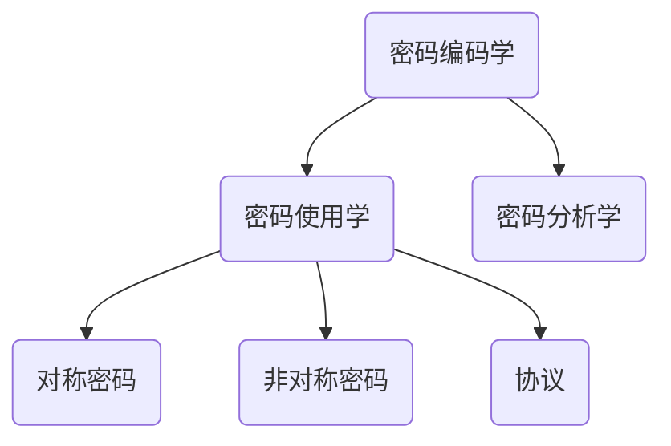
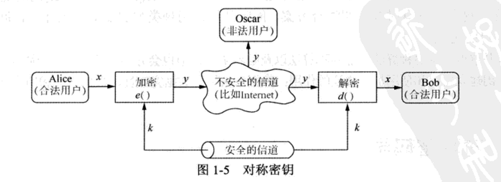

## 第一章 密码学和数据安全导论

### 1.1 密码及本书内容概述

密码编码学及其分支

**密码使用学**指的是一种为了达到隐藏消息含义目的而是用的密文书写的科学。

**密码分析学**本身就是一种科学，在某些情况下也指一种破译密码体制的技巧。

**对称算法(Symmetric Algorithm)**: 双方共享一个密钥，并使用相同的加密方法和解密方法。

**非对称算法(Asymmetric Algorithm)或公钥算法(Public-Key Algorihtm)**: 与对称密码学一样，在公钥密码学中用户也拥有一个密钥；但不同的是，他还同时拥有一个公钥。

**(补充** —— **非对称加密**是一种加密技术，使用一对密钥（公钥和私钥）来加密和解密数据。公钥可以公开，用于加密数据，而私钥必须保密，用于解密数据。这种方法也被称为**公钥加密**。非对称加密的核心在于密钥的分离。发送方使用接收方的公钥加密数据，只有接收方的私钥才能解密。这种机制避免了传统对称加密中密钥分发的安全问题。**)**

**密码协议(Cryptographic Protocol)**: 密码协议主要针对是密码学算法的应用。密码协议的一个典型示例就是**传输层安全(TLS)**方案。

### 1.2 对称密码学

#### 1.2.1 基础知识

对称加密方案也称为对称密钥(Symmetric-key)、秘密密钥(secret-key)和单密钥(Single-key)方案(或算法)。

